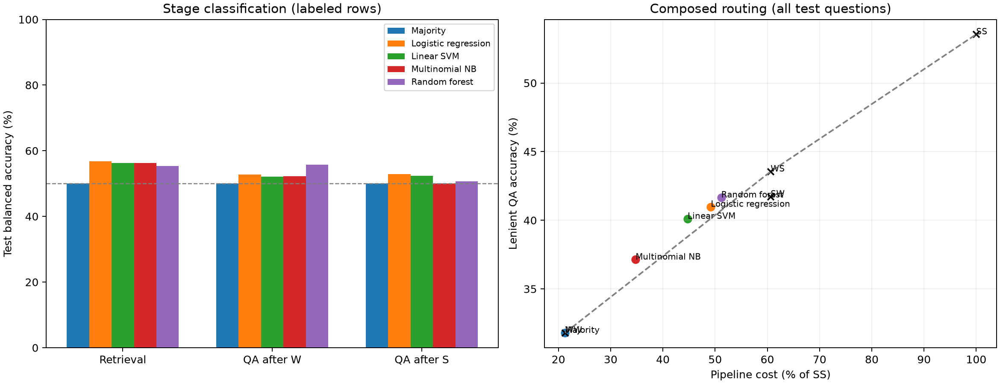

# Non-LLM routing baselines: measured labels

Fixed split: train 4,814 / validation 1,110 / test 1,481.
TF-IDF and classifiers fit only on labeled training examples; None labels are skipped.
Hyperparameters selected by validation balanced accuracy, then macro F1, then accuracy.
All models were frozen before the final test pass. Full composed scores include unresolved rows.

TF-IDF word unigrams/bigrams (up to 60,000 features per stage) feed logistic regression,
linear SVM and multinomial NB. Random forest uses 20 cheap numerical text features.
Retrieval inputs: question and candidate pool. QA inputs: question and the corresponding evidence.
Gold annotations, outcomes and judge scores are not prediction features.

## ret

Only labeled test rows are included in the classification metrics.

| Classifier | Test N | Accuracy % | Balanced accuracy % | Macro F1 % | W recall % | S recall % |
|---|---:|---:|---:|---:|---:|---:|
| Majority | 907 | 69.13 | 50.00 | 40.87 | 100.00 | 0.00 |
| Logistic regression | 907 | 58.21 | 56.73 | 55.29 | 60.61 | 52.86 |
| Linear SVM | 907 | 59.54 | 56.30 | 55.54 | 64.75 | 47.86 |
| Multinomial NB | 907 | 62.51 | 56.28 | 56.26 | 72.57 | 40.00 |
| Random forest | 907 | 59.32 | 55.35 | 54.82 | 65.71 | 45.00 |

## qa_W

Only labeled test rows are included in the classification metrics.

| Classifier | Test N | Accuracy % | Balanced accuracy % | Macro F1 % | W recall % | S recall % |
|---|---:|---:|---:|---:|---:|---:|
| Majority | 684 | 68.86 | 50.00 | 40.78 | 100.00 | 0.00 |
| Logistic regression | 684 | 59.21 | 52.77 | 52.75 | 69.85 | 35.68 |
| Linear SVM | 684 | 62.28 | 52.17 | 51.88 | 78.98 | 25.35 |
| Multinomial NB | 684 | 68.86 | 52.19 | 47.38 | 96.39 | 7.98 |
| Random forest | 684 | 60.09 | 55.72 | 55.34 | 67.30 | 44.13 |

## qa_S

Only labeled test rows are included in the classification metrics.

| Classifier | Test N | Accuracy % | Balanced accuracy % | Macro F1 % | W recall % | S recall % |
|---|---:|---:|---:|---:|---:|---:|
| Majority | 848 | 72.88 | 50.00 | 42.16 | 100.00 | 0.00 |
| Logistic regression | 848 | 59.79 | 52.89 | 52.46 | 67.96 | 37.83 |
| Linear SVM | 848 | 64.39 | 52.36 | 52.37 | 78.64 | 26.09 |
| Multinomial NB | 848 | 72.88 | 50.00 | 42.16 | 100.00 | 0.00 |
| Random forest | 848 | 56.84 | 50.73 | 50.18 | 64.08 | 37.39 |

## Composed pipeline: all 1,481 test questions

| Classifier | Lenient % | Strict % | Cost % of SS | Gain over fixed-policy mixture (pp) | WW / WS / SW / SS |
|---|---:|---:|---:|---:|---|
| Majority | 31.80 | 29.24 | 21.28 | +0.00 | 1481 / 0 / 0 / 0 |
| Logistic regression | 40.99 | 37.34 | 49.18 | +0.85 | 574 / 263 / 501 / 143 |
| Linear SVM | 40.11 | 36.46 | 44.74 | +1.30 | 717 / 181 / 464 / 119 |
| Multinomial NB | 37.14 | 34.17 | 34.78 | +1.30 | 973 / 53 / 455 / 0 |
| Random forest | 41.66 | 37.95 | 51.18 | +0.93 | 566 / 283 / 422 / 210 |

The frontier is the best analytical mixture of fixed policies at or below the router's cost.
It gives a cost-matched baseline and does not use per-question routing information.

| Fixed policy | Lenient % | Strict % | Cost % of SS |
|---|---:|---:|---:|
| WW | 31.80 | 29.24 | 21.28 |
| WS | 43.55 | 38.76 | 60.64 |
| SW | 41.73 | 38.08 | 60.64 |
| SS | 53.54 | 48.14 | 100.00 |

Measured lenient oracle: 61.24%.

Costs are the original pipeline FLOP units (2.0 / 5.7 / 5.7 / 9.4); CPU router overhead is excluded.
This evaluates choices against the existing measured grid; it does not run the new GGUF models.
Scores apply to this fixed split. They do not establish statistical significance or performance on other datasets.

